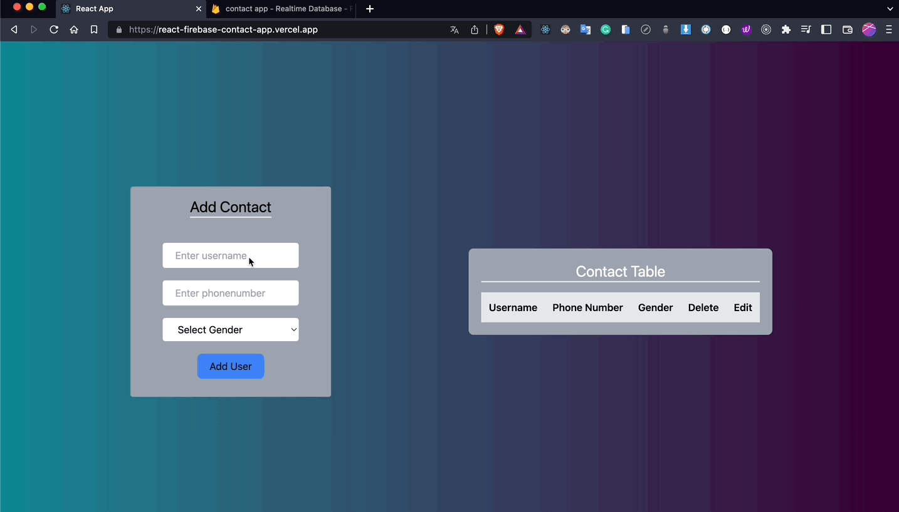

# Project : Conatct App

## Table of contents

  - [The challenge](#the-challenge)
  - [Screenshot](#screenshot)
  - [Project Skeleton ](#project-skeleton)
  - [Links](#links)
  - [Built with](#built-with)
  - [Useful resources](#useful-resources)


## The challenge
Project aims to create a Contact App with React.

## Problem Statement

- Develop a contact app using with Firebase and React
<hr>


## Project Skeleton 

```
Contact App (folder)
|
|----readme.md         
├── public
│     └── index.html
├── src
│    ├── components
│    │       ├── form
│    │       │     └── Form.js
│    │       └── table
│    │             └── Table.js
│    ├── utils
│    │       ├── customToastify.js
│    │       └── firebase.js
│    ├── App.js
│    ├── App.css
│    ├── index.js
│    └── index.css
├── package.json
└── yarn.lock
```


## Screenshot
<p align="center">
<a href="https://react-firebase-contact-app.vercel.app/"></a>
</p>


## Links
<hr>
<b>Check The Live Website ➡️</b> <a href="https://react-firebase-contact-app.vercel.app/">Live Website</a>
<hr>

### Built with
- I made a Contact App with React & Firebase(for Database).
- User can add, delete and edit contacts.
- I used Tailwind for styling.
- I used Firebase Realtime Database for storage.
---
I used;
- Firebase
- Tailwind
- Components
- useState
- useEffect
- import/export
- Props
- React Developer Tool
- Destructuring props
- array map method


## Notes

- You can use HTML,CSS ,JAVASCRIPT and REACT to complete this project.

### Useful resources

- [W3 Schoold](https://www.w3schools.com/) 
- [MDN](https://developer.mozilla.org/en-US/) 
- [REACT](https://reactjs.org/) 
- [TAILWIND](https://tailwindcss.com/) 


<center> &#8987; Happy Coding  &#9997; </center>
